  # Contents

  The part in brackets is a summary and not a full list of everything each shader affects. Only the more common things are listed here for quick access.

  - [Non-Rendertype](#non-rendertype)
    - [blit_screen](#blit_screen) (Copy)
    - [particle](#particle) (Particles)
    - [position](#position) (Sky)
    - [position_color](#position_color) (Pre 1.20 Solid Color UI)
    - [position_tex](#position_tex) (Worldborder, Sun/Moon)
    - [position_tex_color](#position_tex_color) (Fire, Wall Overlay, End Sky, Menu Background)
  - [Rendertype](#rendertype)
    - [Blocks](#blocks)
      - [solid](#solid) (Solid Blocks, Lava, Solid Falling Blocks)
      - [cutout](#cutout) (Most Non-Cube-Hitbox Blocks)
      - [cutout_mipped](#cutout_mipped) (Some Non-Cube-Hitbox Blocks)
      - [translucent](#translucent) (Water, Transparent Blocks)
      - [translucent_moving_block](#translucent_moving_block) (Moving Blocks from Pistons)
      - [tripwire](#tripwire) (Tripwire (Middle Section))
      - [end_portal](#end_portal-and-end_gateway) (End Portal)
      - [end_gateway](#end_portal-and-end_gateway) (End Gateway)
    - [Entities](#entities)
      - [entity_cutout_no_cull](#entity_cutout_no_cull) (Entities)
      - [entity_translucent](#entity_translucent) (Overlays/Transparent Parts)
      - [entity_solid](#entity_solid) (Entity-style Objects)
      - [entity_translucent_cull](#entity_translucent_cull) (Non-block-placing Items)
      - [entity_cutout](#entity_cutout) (Block-placing Items)
      - [armor_cutout_no_cull](#armor_cutout_no_cull) (Armor)
      - [armor_entity_glint](#armor_entity_glint) (Worn Armor Enchant Glint)
      - [entity_glint_direct](#entity_glint_direct) (Enchanted Trident Glint)
      - [glint](#glint) (Standard Enchant Glint)
      - [glint_translucent](#glint_translucent) (Glass enchanted glint in `Fabulous!`)
      - [energy_swirl](#energy_swirl) (Charged Creeper, Wither Swirl)
      - [eyes](#eyes) (Entities with glowing eyes)
      - [leash](#leash) (Leash)
      - [entity_shadow](#entity_shadow) (Entity Shadow)
      - [entity_cutout_no_cull_z_offset](#entity_cutout_no_cull_z_offset) (Mob Skulls, Minecart, Shulker)
      - [entity_decal](#entity_decal) (Ender Dragon Death)
      - [entity_alpha](#entity_alpha) (Ender Dragon Death Wings)
      - [item_entity_translucent_cull](#item_entity_translucent_cull) (XP Orbs, Fabulous translucent items, Invisible Entities)
      - [entity_smooth_cutout](#entity_smooth_cutout) (End Crystal Beams)
      - [entity_translucent_emissive](#entity_translucent_emissive) (Glowing parts of Warden texture)
      - [entity_no_outline](#entity_no_outline) (Banner)
      - [water_mask](#water_mask) (Hides water in boats)
      - [outline](#outline) (Glowing)
      - [lightning](#lightning) (Lightning, Ender dragon death animation beams)
    - [UI](#ui)
      - [gui](#gui) (Solid Color UI)
      - [gui_ghost_recipe_overlay](#gui_ghost_recipe_overlay) (Recipe Book Missing Item Overlay)
      - [gui_overlay](#gui_overlay) (Generic Overlay Effects)
      - [gui_text_highlight](#gui_text_highlight) (Highlighted Text)
      - [text](#text) (Text)
      - [text_see_through](#text_see_through) (Name Plates, Text Through Walls)
      - [text_background](#text_background) (Text Display Entity Background)
      - [text_background_see_through](#text_background_see_through) (Text Display Entity Background Through Walls)
      - [text_intensity](#text_intensity) (TTF Fonts)
      - [text_intensity_see_through](#text_intensity_see_through) (TTF Fonts Through Walls)
    - [Other](#other)
      - [lines](#lines) (Block Outline, Hitboxes, Fishing Rod Line)
      - [clouds](#clouds) (Clouds)
      - [crumbling](#crumbling) (Mining Block Cracks)
      - [beacon_beam](#beacon_beam) (Beacon Beam)
  - [Unknown](#unknown)
    - [position_color_lightmap](#position_color_lightmap)
    - [position_color_tex_lightmap](#position_color_tex_lightmap)
  - [Removed/Unused](#removed)
    - position_tex_color_lightmap (Unused)
    - position_color_lightmap (Unused)
    - [block](#block)
    - [new_entity](#new_entity)
    - [rendertype_translucent_no_crumbling](#rendertype_translucent_no_crumbling)
    - [position_color_tex](#position_color_tex)
    - [rendertype_glint_direct](#rendertype_glint_direct)
    - [rendertype_armor_glint](#rendertype_armor_glint)

  # Non-Rendertype
  There are several shaders which are not prefixed with `rendertype_`. These seem to be for more general targets, such as the sky or all particles.  

  ### blit_screen 
  <h6>
    View on mcmeta:
    <a title="Open blit_screen.json on mcmeta" href="https://github.com/misode/mcmeta/blob/assets/assets/minecraft/shaders/core/blit_screen.json">json</a> • 
    <a title="Open blit_screen.vsh on mcmeta" href="https://github.com/misode/mcmeta/blob/assets/assets/minecraft/shaders/core/blit_screen.vsh">vsh</a> • 
    <a title="Open blit_screen.fsh on mcmeta" href="https://github.com/misode/mcmeta/blob/assets/assets/minecraft/shaders/core/blit_screen.fsh">fsh</a>
  </h6>
  
  Blit copies one buffer to another, however this cannot be overridden in a resource pack.

  [Back to Top](#contents)

  ---

  ### particle 
  <h6>
    View on mcmeta:
    <a title="Open particle.json on mcmeta" href="https://github.com/misode/mcmeta/blob/assets/assets/minecraft/shaders/core/particle.json">json</a> • 
    <a title="Open particle.vsh on mcmeta" href="https://github.com/misode/mcmeta/blob/assets/assets/minecraft/shaders/core/particle.vsh">vsh</a> • 
    <a title="Open particle.fsh on mcmeta" href="https://github.com/misode/mcmeta/blob/assets/assets/minecraft/shaders/core/particle.fsh">fsh</a>
  </h6>

  Weather (snow and rain) and all particles. The alpha value specified in the shader will override the particle’s inbuilt transparency e.g. in the sneeze particle. Others, like the splash particle, don't seem to allow this. More testing needed.

  [Back to Top](#contents)

  ---

  ### position 
  <h6>
    View on mcmeta:
    <a title="Open position.json on mcmeta" href="https://github.com/misode/mcmeta/blob/assets/assets/minecraft/shaders/core/position.json">json</a> • 
    <a title="Open position.vsh on mcmeta" href="https://github.com/misode/mcmeta/blob/assets/assets/minecraft/shaders/core/position.vsh">vsh</a> • 
    <a title="Open position.fsh on mcmeta" href="https://github.com/misode/mcmeta/blob/assets/assets/minecraft/shaders/core/position.fsh">fsh</a>
  </h6>

  The colour of the sky. Also affects text highlighting. 

  [Back to Top](#contents)

  ---

  ### position_color 
  <h6>
    View on mcmeta:
    <a title="Open position_color.json on mcmeta" href="https://github.com/misode/mcmeta/blob/assets/assets/minecraft/shaders/core/position_color.json">json</a> • 
    <a title="Open position_color.vsh on mcmeta" href="https://github.com/misode/mcmeta/blob/assets/assets/minecraft/shaders/core/position_color.vsh">vsh</a> • 
    <a title="Open position_color.fsh on mcmeta" href="https://github.com/misode/mcmeta/blob/assets/assets/minecraft/shaders/core/position_color.fsh">fsh</a>
  </h6>

  Handles a few different things:
  * The transparent lower hemisphere overlay on the sky approximately between times 11315 to 14150 (sunset) and 21830 to 24670 (sunrise),
  * The f3+G chunk border displays,

  Pre 1.20:
  * The black transparent background on UI elements such as the chat field, the pause menu, and the scoreboard sidebar,
  * The Mojang loading background,
  * Highlighting item slots,
  * The background of tooltips,
  * The black bars on the sides when scoped in with a spyglass,

  For UI elements, Position is the screen size divided by the GUI scale. E.g. 1920x1080 with GUI scale 3 means Position for x will be [0,640] and for y [0,360].

  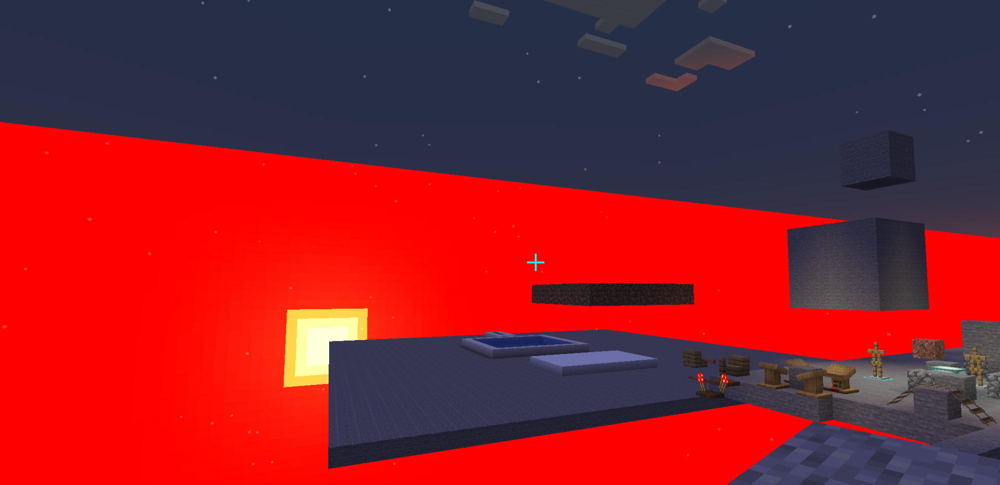

  [Back to Top](#contents)

  ---

  ### position_tex 
  <h6>
    View on mcmeta:
    <a title="Open position_tex.json on mcmeta" href="https://github.com/misode/mcmeta/blob/assets/assets/minecraft/shaders/core/position_tex.json">json</a> • 
    <a title="Open position_tex.vsh on mcmeta" href="https://github.com/misode/mcmeta/blob/assets/assets/minecraft/shaders/core/position_tex.vsh">vsh</a> • 
    <a title="Open position_tex.fsh on mcmeta" href="https://github.com/misode/mcmeta/blob/assets/assets/minecraft/shaders/core/position_tex.fsh">fsh</a>
  </h6>

  Handles a few different things:
  * The Sun and Moon
  * The worldborder
  
  Also affects:
  * Chunk border display
  * Sky
  * Sunset and sunrise halo

  Previously affect some gui elements, which were moved to `position_tex_color`.

  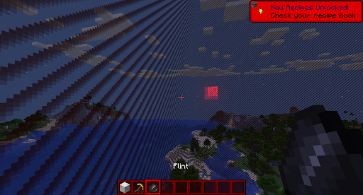 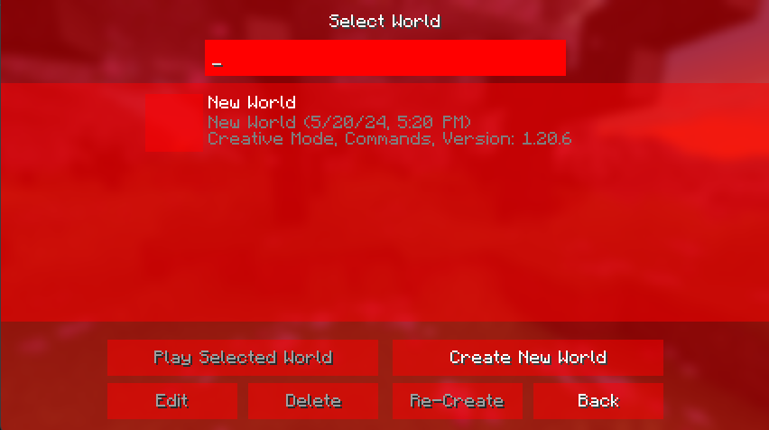

  [Back to Top](#contents)

  ---

  ### position_tex_color 
  <h6>
    View on mcmeta:
    <a title="Open position_tex_color.json on mcmeta" href="https://github.com/misode/mcmeta/blob/assets/assets/minecraft/shaders/core/position_tex_color.json">json</a> • 
    <a title="Open position_tex_color.vsh on mcmeta" href="https://github.com/misode/mcmeta/blob/assets/assets/minecraft/shaders/core/position_tex_color.vsh">vsh</a> • 
    <a title="Open position_tex_color.fsh on mcmeta" href="https://github.com/misode/mcmeta/blob/assets/assets/minecraft/shaders/core/position_tex_color.fsh">fsh</a>
  </h6>

  Handles:
  * The End sky
  * main menu panorama and menu backgrounds
  * Most GUI textures (hotbar, buttons, icons, etc.)
  * Overlays (Vignette, Pumpkin blur, Powdered snow, Fire, Suffocation)
  * Mojang/Minecraft logo

  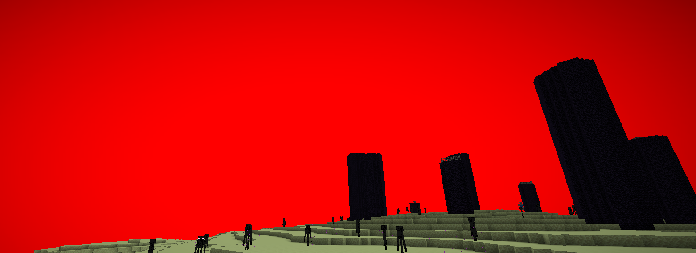
  
  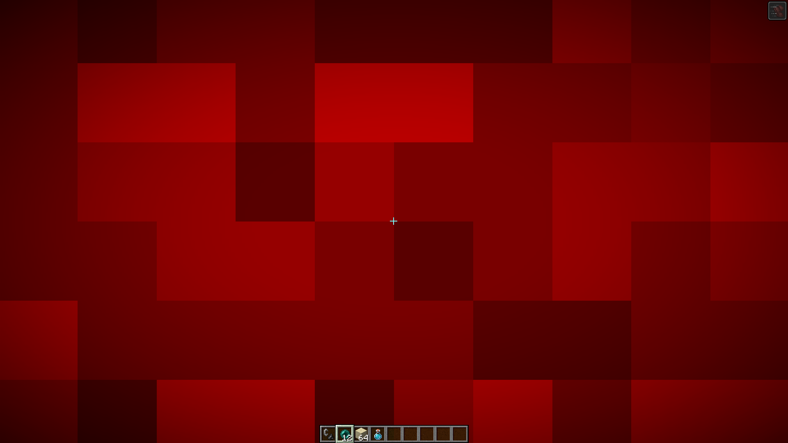

  [Back to Top](#contents)

  # Rendertype
  These are shaders which are targeted towards a specific element of the display.
  **For each shader name here, assume that it is prefixed with `rendertype_`.**

  ## Blocks
  When dealing with block shaders which have something to do with `translucent`, `cutout` or `cutout_mipped`, here is a [useful list](List%20of%20Blocks%20Affected.md) for all blocks of those specific types.

  [Back to Top](#contents)

  ### solid 
  <h6>
    View on mcmeta:
    <a title="Open rendertype_solid.json on mcmeta" href="https://github.com/misode/mcmeta/blob/assets/assets/minecraft/shaders/core/rendertype_solid.json">json</a> • 
    <a title="Open rendertype_solid.vsh on mcmeta" href="https://github.com/misode/mcmeta/blob/assets/assets/minecraft/shaders/core/rendertype_solid.vsh">vsh</a> • 
    <a title="Open rendertype_solid.fsh on mcmeta" href="https://github.com/misode/mcmeta/blob/assets/assets/minecraft/shaders/core/rendertype_solid.fsh">fsh</a>
  </h6>

  All solid blocks, lava, and when in fast mode, leaves. Also affects non-translucent falling blocks.

  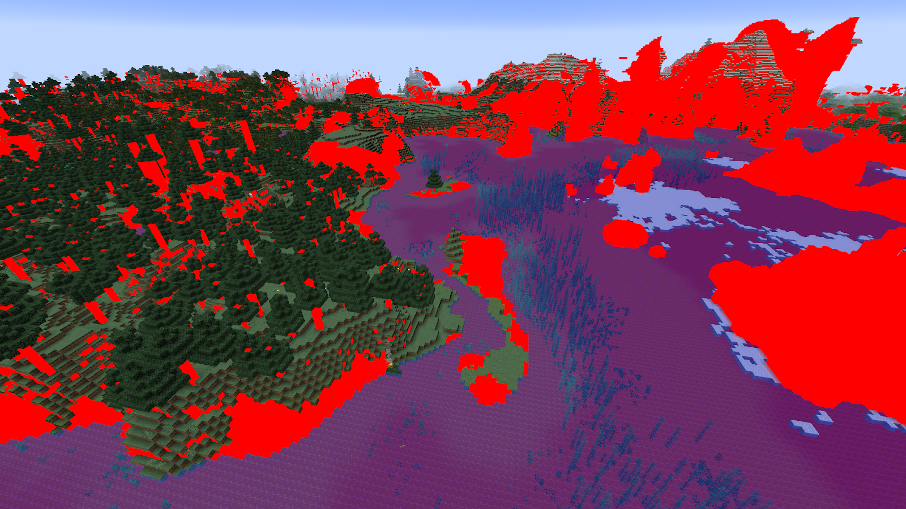 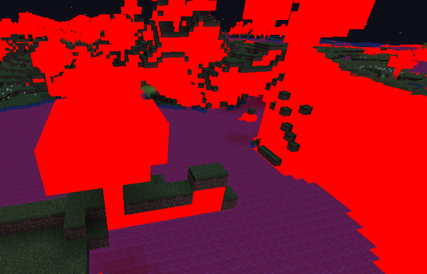

  [Back to Top](#contents)

  ---

  ### cutout 
  <h6>
    View on mcmeta:
    <a title="Open rendertype_cutout.json on mcmeta" href="https://github.com/misode/mcmeta/blob/assets/assets/minecraft/shaders/core/rendertype_cutout.json">json</a> • 
    <a title="Open rendertype_cutout.vsh on mcmeta" href="https://github.com/misode/mcmeta/blob/assets/assets/minecraft/shaders/core/rendertype_cutout.vsh">vsh</a> • 
    <a title="Open rendertype_cutout.fsh on mcmeta" href="https://github.com/misode/mcmeta/blob/assets/assets/minecraft/shaders/core/rendertype_cutout.fsh">fsh</a>
  </h6>

  All non-cube-hitbox blocks, check the list in the section header.
  A list of all blocks rendered by this shader can be found [here](List%20of%20Blocks%20Affected.md#cutout).

  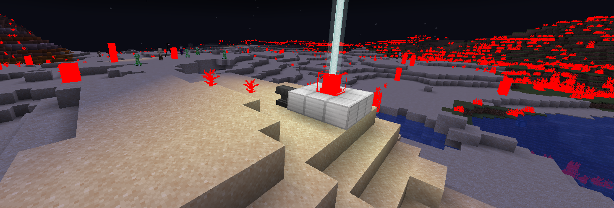

  [Back to Top](#contents)

  ---

  ### cutout_mipped 
  <h6>
    View on mcmeta:
    <a title="Open rendertype_cutout_mipped.json on mcmeta" href="https://github.com/misode/mcmeta/blob/assets/assets/minecraft/shaders/core/rendertype_cutout_mipped.json">json</a> • 
    <a title="Open rendertype_cutout_mipped.vsh on mcmeta" href="https://github.com/misode/mcmeta/blob/assets/assets/minecraft/shaders/core/rendertype_cutout_mipped.vsh">vsh</a> • 
    <a title="Open rendertype_cutout_mipped.fsh on mcmeta" href="https://github.com/misode/mcmeta/blob/assets/assets/minecraft/shaders/core/rendertype_cutout_mipped.fsh">fsh</a>
  </h6>

  Certain blocks not covered by other shaders, check the list in the section header. Covers leaves in fancy/fabulous graphics.
  A list of all blocks rendered by this shader can be found [here](List%20of%20Blocks%20Affected.md#cutout_mipped).

  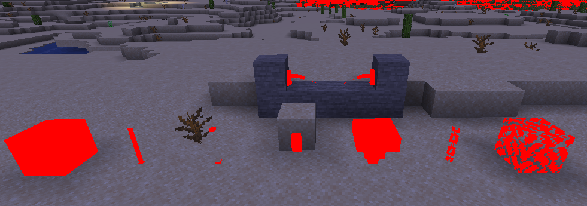

  [Back to Top](#contents)

  ---

  ### translucent 
  <h6>
    View on mcmeta:
    <a title="Open rendertype_translucent.json on mcmeta" href="https://github.com/misode/mcmeta/blob/assets/assets/minecraft/shaders/core/rendertype_translucent.json">json</a> • 
    <a title="Open rendertype_translucent.vsh on mcmeta" href="https://github.com/misode/mcmeta/blob/assets/assets/minecraft/shaders/core/rendertype_translucent.vsh">vsh</a> • 
    <a title="Open rendertype_translucent.fsh on mcmeta" href="https://github.com/misode/mcmeta/blob/assets/assets/minecraft/shaders/core/rendertype_translucent.fsh">fsh</a>
  </h6>

  Translucent blocks like stained glass, check the list in the section header.
  A list of all blocks rendered by this shader can be found [here](List%20of%20Blocks%20Affected.md#translucent).

  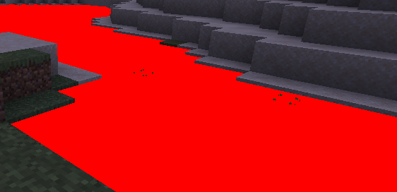 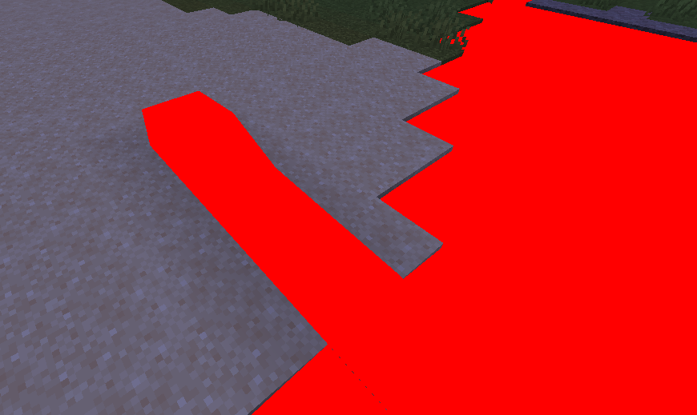

  [Back to Top](#contents)

  ---

  ### translucent_moving_block 
  <h6>
    View on mcmeta:
    <a title="Open rendertype_translucent_moving_block.json on mcmeta" href="https://github.com/misode/mcmeta/blob/assets/assets/minecraft/shaders/core/rendertype_translucent_moving_block.json">json</a> • 
    <a title="Open rendertype_translucent_moving_block.vsh on mcmeta" href="https://github.com/misode/mcmeta/blob/assets/assets/minecraft/shaders/core/rendertype_translucent_moving_block.vsh">vsh</a> • 
    <a title="Open rendertype_translucent_moving_block.fsh on mcmeta" href="https://github.com/misode/mcmeta/blob/assets/assets/minecraft/shaders/core/rendertype_translucent_moving_block.fsh">fsh</a>
  </h6>

  Blocks which are translucent and are being moved by a piston.

  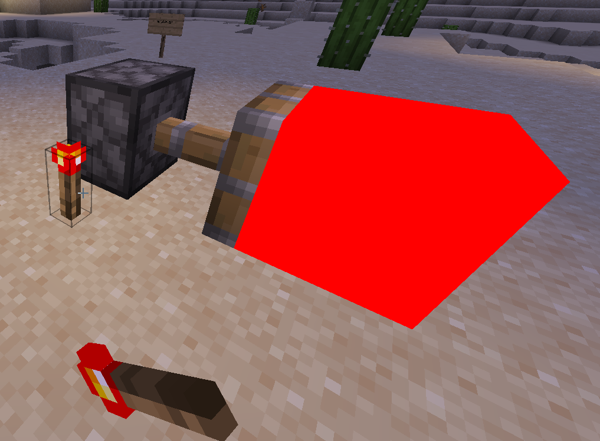

  [Back to Top](#contents)

  ---

  ### tripwire 
  <h6>
    View on mcmeta:
    <a title="Open rendertype_tripwire.json on mcmeta" href="https://github.com/misode/mcmeta/blob/assets/assets/minecraft/shaders/core/rendertype_tripwire.json">json</a> • 
    <a title="Open rendertype_tripwire.vsh on mcmeta" href="https://github.com/misode/mcmeta/blob/assets/assets/minecraft/shaders/core/rendertype_tripwire.vsh">vsh</a> • 
    <a title="Open rendertype_tripwire.fsh on mcmeta" href="https://github.com/misode/mcmeta/blob/assets/assets/minecraft/shaders/core/rendertype_tripwire.fsh">fsh</a>
  </h6>

  The middle section(s) of a tripwire.  

  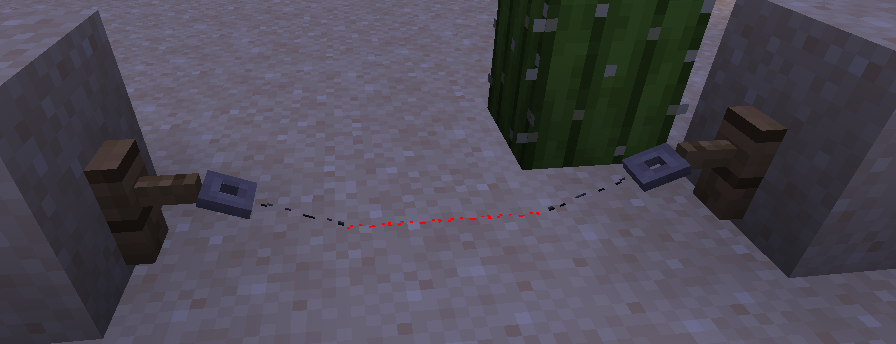

  [Back to Top](#contents)

  ---

  ### end_portal (and end_gateway) 
  <h6>
    View on mcmeta:
    <a title="Open rendertype_end_portal.json on mcmeta" href="https://github.com/misode/mcmeta/blob/assets/assets/minecraft/shaders/core/rendertype_end_portal.json">json</a> • 
    <a title="Open rendertype_end_portal.vsh on mcmeta" href="https://github.com/misode/mcmeta/blob/assets/assets/minecraft/shaders/core/rendertype_end_portal.vsh">vsh</a> • 
    <a title="Open rendertype_end_portal.fsh on mcmeta" href="https://github.com/misode/mcmeta/blob/assets/assets/minecraft/shaders/core/rendertype_end_portal.fsh">fsh</a>
  </h6>

  The strange image in the end portal and end gateways.
  The shader files are called `end_portal.vsh`/`fsh`/`json`, with `end_gateway.json` referencing them.

  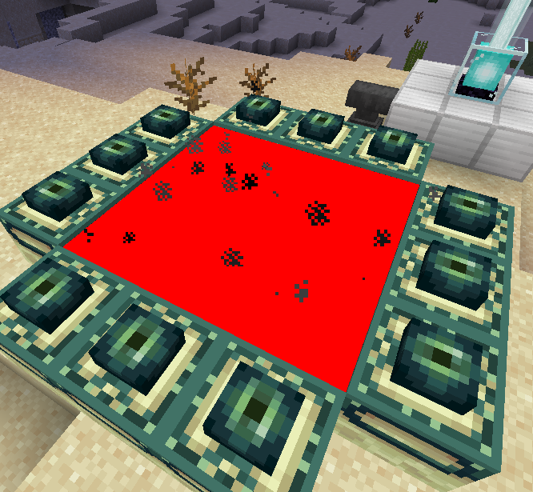 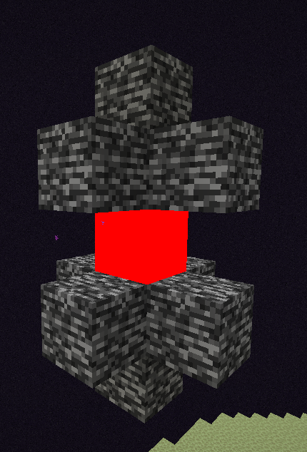

  [Back to Top](#contents)

  ---

  ## Entities
  Shaders that render entities.

  ### entity_cutout_no_cull 
  <h6>
    View on mcmeta:
    <a title="Open rendertype_entity_cutout_no_cull.json on mcmeta" href="https://github.com/misode/mcmeta/blob/assets/assets/minecraft/shaders/core/rendertype_entity_cutout_no_cull.json">json</a> • 
    <a title="Open rendertype_entity_cutout_no_cull.vsh on mcmeta" href="https://github.com/misode/mcmeta/blob/assets/assets/minecraft/shaders/core/rendertype_entity_cutout_no_cull.vsh">vsh</a> • 
    <a title="Open rendertype_entity_cutout_no_cull.fsh on mcmeta" href="https://github.com/misode/mcmeta/blob/assets/assets/minecraft/shaders/core/rendertype_entity_cutout_no_cull.fsh">fsh</a>
  </h6>

  * All entities
  * Guardian beams
  * Placed signs
  * Shulker boxes (both placed and in inventory)
  * Player heads (if player is using one of the default Minecraft skins: Alex, Steve, etc.)

  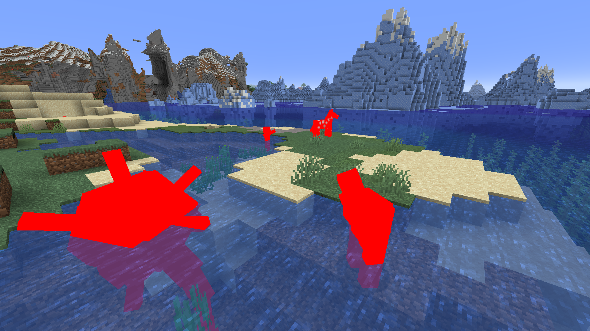  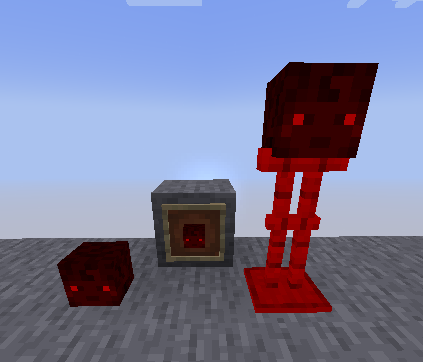

  [Back to Top](#contents)

  ---

  ### entity_translucent 
  <h6>
    View on mcmeta:
    <a title="Open rendertype_entity_translucent.json on mcmeta" href="https://github.com/misode/mcmeta/blob/assets/assets/minecraft/shaders/core/rendertype_entity_translucent.json">json</a> • 
    <a title="Open rendertype_entity_translucent.vsh on mcmeta" href="https://github.com/misode/mcmeta/blob/assets/assets/minecraft/shaders/core/rendertype_entity_translucent.vsh">vsh</a> • 
    <a title="Open rendertype_entity_translucent.fsh on mcmeta" href="https://github.com/misode/mcmeta/blob/assets/assets/minecraft/shaders/core/rendertype_entity_translucent.fsh">fsh</a>
  </h6>

  Translucent entities and parts of entities: 
  * Slimes
  * Players (except for the lower layer of the arm in first person)
  * Player heads (if player has set a custom skin)
  * Markings on horses
  * Some other horses parts
  * Shulker bullets
  * Elder guardian particle effect
  * Piglin
  * Zombified Piglin

  Sampler1 contains the red color that is overlayed on entities when they take damage.

  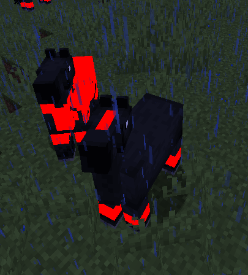 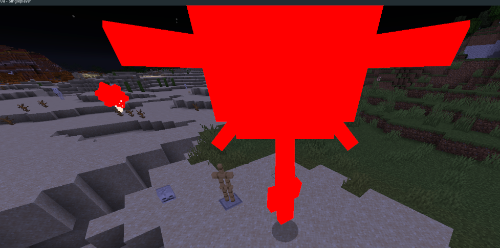 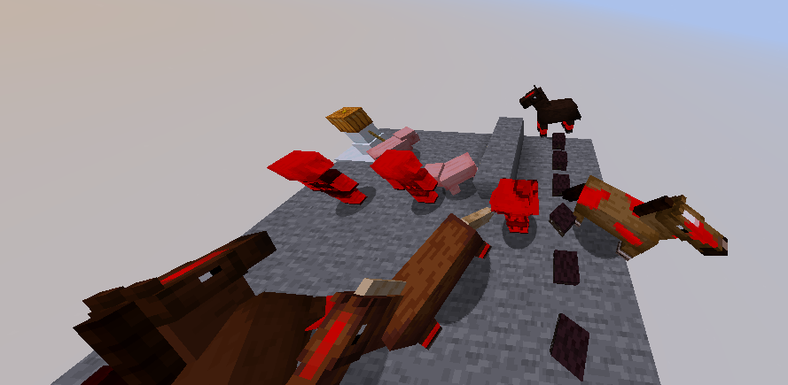

  [Back to Top](#contents)

  ---

  ### entity_solid 
  <h6>
    View on mcmeta:
    <a title="Open rendertype_entity_solid.json on mcmeta" href="https://github.com/misode/mcmeta/blob/assets/assets/minecraft/shaders/core/rendertype_entity_solid.json">json</a> • 
    <a title="Open rendertype_entity_solid.vsh on mcmeta" href="https://github.com/misode/mcmeta/blob/assets/assets/minecraft/shaders/core/rendertype_entity_solid.vsh">vsh</a> • 
    <a title="Open rendertype_entity_solid.fsh on mcmeta" href="https://github.com/misode/mcmeta/blob/assets/assets/minecraft/shaders/core/rendertype_entity_solid.fsh">fsh</a>
  </h6>

  Handles a few different things: 
  * The base (not flag) of banners,
  * Shulker heads, 
  * Books on lecterns/enchantment tables, 
  * Shields, 
  * Beds, 
  * The bell part of bells, 
  * Capes, 
  * Shells of conduits, 
  * Paintings, 
  * Tridents, 
  * The ears on the Deadmau5 skin,
  * The bottom skin layer of the first-person hand,
  * The conduit item in the inventory.

  With item frames, the item frame entity itself is part of the shader, however, items on it are not. Only the filled-in parts of maps placed on an item frame are part of the shader.

  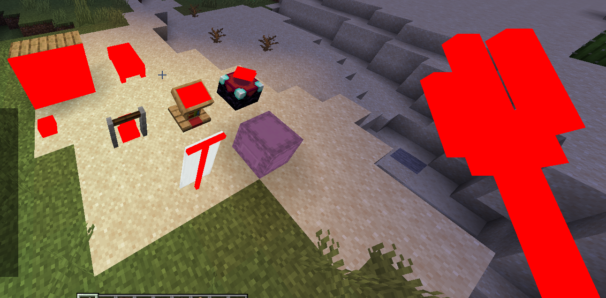 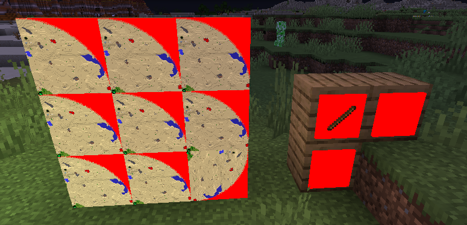 

  [Back to Top](#contents)

  ---

  ### entity_translucent_cull 
  <h6>
    View on mcmeta:
    <a title="Open rendertype_entity_translucent_cull.json on mcmeta" href="https://github.com/misode/mcmeta/blob/assets/assets/minecraft/shaders/core/rendertype_entity_translucent_cull.json">json</a> • 
    <a title="Open rendertype_entity_translucent_cull.vsh on mcmeta" href="https://github.com/misode/mcmeta/blob/assets/assets/minecraft/shaders/core/rendertype_entity_translucent_cull.vsh">vsh</a> • 
    <a title="Open rendertype_entity_translucent_cull.fsh on mcmeta" href="https://github.com/misode/mcmeta/blob/assets/assets/minecraft/shaders/core/rendertype_entity_translucent_cull.fsh">fsh</a>
  </h6>

  Flat texture items and transparent blocks held by entities or on head, in the inventory, and as entities. If Fabulous graphics is off, this shader also affects translucent items like stained glass and their panes, however if it is on, you should check [item_entity_translucent_cull](#item_entity_translucent_cull).

  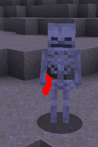 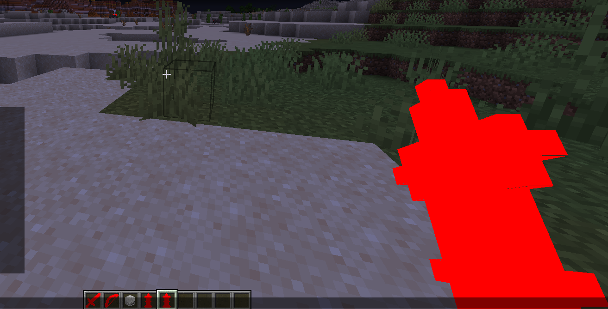

  [Back to Top](#contents)

  ---

  ### armor_cutout_no_cull 
  <h6>
    View on mcmeta:
    <a title="Open rendertype_armor_cutout_no_cull.json on mcmeta" href="https://github.com/misode/mcmeta/blob/assets/assets/minecraft/shaders/core/rendertype_armor_cutout_no_cull.json">json</a> • 
    <a title="Open rendertype_armor_cutout_no_cull.vsh on mcmeta" href="https://github.com/misode/mcmeta/blob/assets/assets/minecraft/shaders/core/rendertype_armor_cutout_no_cull.vsh">vsh</a> • 
    <a title="Open rendertype_armor_cutout_no_cull.fsh on mcmeta" href="https://github.com/misode/mcmeta/blob/assets/assets/minecraft/shaders/core/rendertype_armor_cutout_no_cull.fsh">fsh</a>
  </h6>

  Armor and armor trims on entities.

  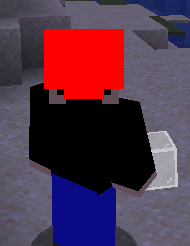

  [Back to Top](#contents)

  ---

  ### armor_entity_glint 
  <h6>
    View on mcmeta:
    <a title="Open rendertype_armor_entity_glint.json on mcmeta" href="https://github.com/misode/mcmeta/blob/assets/assets/minecraft/shaders/core/rendertype_armor_entity_glint.json">json</a> • 
    <a title="Open rendertype_armor_entity_glint.vsh on mcmeta" href="https://github.com/misode/mcmeta/blob/assets/assets/minecraft/shaders/core/rendertype_armor_entity_glint.vsh">vsh</a> • 
    <a title="Open rendertype_armor_entity_glint.fsh on mcmeta" href="https://github.com/misode/mcmeta/blob/assets/assets/minecraft/shaders/core/rendertype_armor_entity_glint.fsh">fsh</a>
  </h6>

  The glint on enchanted armour. Slight transparency is inbuilt and unchangeable.

  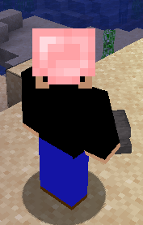

  [Back to Top](#contents)

  ---

  ### entity_glint_direct 
  <h6>
    View on mcmeta:
    <a title="Open rendertype_entity_glint_direct.json on mcmeta" href="https://github.com/misode/mcmeta/blob/assets/assets/minecraft/shaders/core/rendertype_entity_glint_direct.json">json</a> • 
    <a title="Open rendertype_entity_glint_direct.vsh on mcmeta" href="https://github.com/misode/mcmeta/blob/assets/assets/minecraft/shaders/core/rendertype_entity_glint_direct.vsh">vsh</a> • 
    <a title="Open rendertype_entity_glint_direct.fsh on mcmeta" href="https://github.com/misode/mcmeta/blob/assets/assets/minecraft/shaders/core/rendertype_entity_glint_direct.fsh">fsh</a>
  </h6>

  The glint on enchanted tridents.

  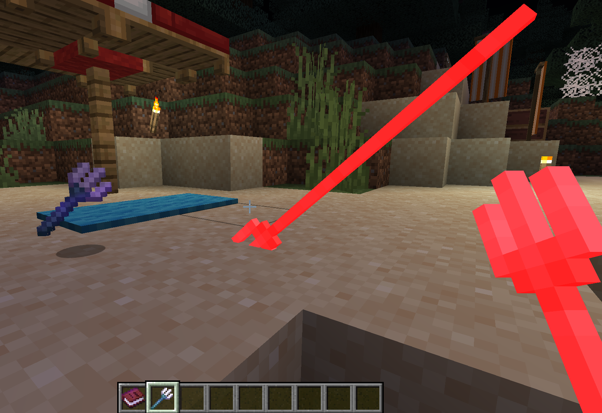

  [Back to Top](#contents)

  ---

  ### glint 
  <h6>
    View on mcmeta:
    <a title="Open rendertype_glint.json on mcmeta" href="https://github.com/misode/mcmeta/blob/assets/assets/minecraft/shaders/core/rendertype_glint.json">json</a> • 
    <a title="Open rendertype_glint.vsh on mcmeta" href="https://github.com/misode/mcmeta/blob/assets/assets/minecraft/shaders/core/rendertype_glint.vsh">vsh</a> • 
    <a title="Open rendertype_glint.fsh on mcmeta" href="https://github.com/misode/mcmeta/blob/assets/assets/minecraft/shaders/core/rendertype_glint.fsh">fsh</a>
  </h6>

  Default enchant glint. Applies to items and blocks, in the inventory or in the world.

  [Back to Top](#contents)

  ---

  ### glint_translucent 
  <h6>
    View on mcmeta:
    <a title="Open rendertype_glint_translucent.json on mcmeta" href="https://github.com/misode/mcmeta/blob/assets/assets/minecraft/shaders/core/rendertype_glint_translucent.json">json</a> • 
    <a title="Open rendertype_glint_translucent.vsh on mcmeta" href="https://github.com/misode/mcmeta/blob/assets/assets/minecraft/shaders/core/rendertype_glint_translucent.vsh">vsh</a> • 
    <a title="Open rendertype_glint_translucent.fsh on mcmeta" href="https://github.com/misode/mcmeta/blob/assets/assets/minecraft/shaders/core/rendertype_glint_translucent.fsh">fsh</a>
  </h6>

  The enchant glint in translucent blocks (like stained glass) in world when graphics setting is `Fabulous!`.

  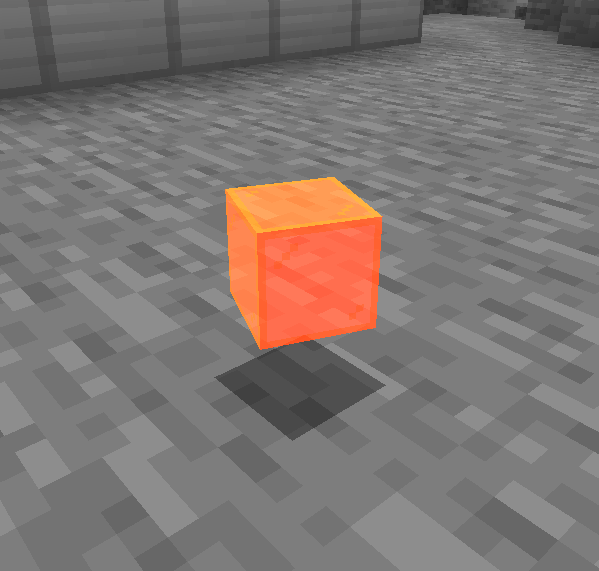 

  [Back to Top](#contents)

  ---

  ### energy_swirl 
  <h6>
    View on mcmeta:
    <a title="Open rendertype_energy_swirl.json on mcmeta" href="https://github.com/misode/mcmeta/blob/assets/assets/minecraft/shaders/core/rendertype_energy_swirl.json">json</a> • 
    <a title="Open rendertype_energy_swirl.vsh on mcmeta" href="https://github.com/misode/mcmeta/blob/assets/assets/minecraft/shaders/core/rendertype_energy_swirl.vsh">vsh</a> • 
    <a title="Open rendertype_energy_swirl.fsh on mcmeta" href="https://github.com/misode/mcmeta/blob/assets/assets/minecraft/shaders/core/rendertype_energy_swirl.fsh">fsh</a>
  </h6>

  Charged creeper and wither swirling outline.

  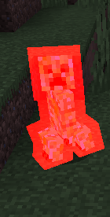 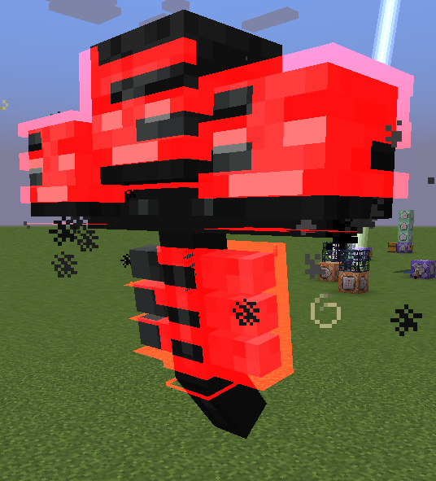

  [Back to Top](#contents)

  ---

  ### eyes 
  <h6>
    View on mcmeta:
    <a title="Open rendertype_eyes.json on mcmeta" href="https://github.com/misode/mcmeta/blob/assets/assets/minecraft/shaders/core/rendertype_eyes.json">json</a> • 
    <a title="Open rendertype_eyes.vsh on mcmeta" href="https://github.com/misode/mcmeta/blob/assets/assets/minecraft/shaders/core/rendertype_eyes.vsh">vsh</a> • 
    <a title="Open rendertype_eyes.fsh on mcmeta" href="https://github.com/misode/mcmeta/blob/assets/assets/minecraft/shaders/core/rendertype_eyes.fsh">fsh</a>
  </h6>

  A shader for the entire body of an entity that has glowing eyes (not the eyes themselves). Not fully opaque.

  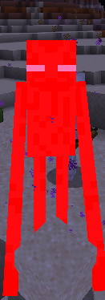 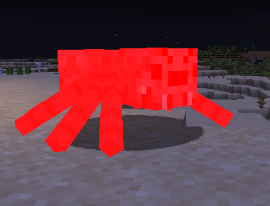

  [Back to Top](#contents)

  ---

  ### leash 
  <h6>
    View on mcmeta:
    <a title="Open rendertype_leash.json on mcmeta" href="https://github.com/misode/mcmeta/blob/assets/assets/minecraft/shaders/core/rendertype_leash.json">json</a> • 
    <a title="Open rendertype_leash.vsh on mcmeta" href="https://github.com/misode/mcmeta/blob/assets/assets/minecraft/shaders/core/rendertype_leash.vsh">vsh</a> • 
    <a title="Open rendertype_leash.fsh on mcmeta" href="https://github.com/misode/mcmeta/blob/assets/assets/minecraft/shaders/core/rendertype_leash.fsh">fsh</a>
  </h6>

  Leads, both on entities and fences.

  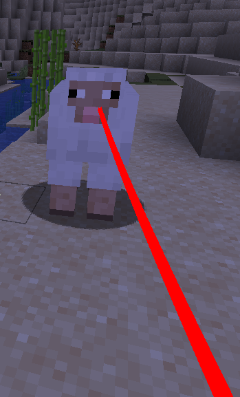 

  [Back to Top](#contents)

  ---

  ### entity_shadow 
  <h6>
    View on mcmeta:
    <a title="Open rendertype_entity_shadow.json on mcmeta" href="https://github.com/misode/mcmeta/blob/assets/assets/minecraft/shaders/core/rendertype_entity_shadow.json">json</a> • 
    <a title="Open rendertype_entity_shadow.vsh on mcmeta" href="https://github.com/misode/mcmeta/blob/assets/assets/minecraft/shaders/core/rendertype_entity_shadow.vsh">vsh</a> • 
    <a title="Open rendertype_entity_shadow.fsh on mcmeta" href="https://github.com/misode/mcmeta/blob/assets/assets/minecraft/shaders/core/rendertype_entity_shadow.fsh">fsh</a>
  </h6>

  Blocks that are affected by an entity’s shadow, but not the shadow itself. Locked to the block grid.

  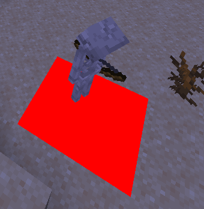 

  [Back to Top](#contents)

  ---

  ### entity_cutout_no_cull_z_offset 
  <h6>
    View on mcmeta:
    <a title="Open rendertype_entity_cutout_no_cull_z_offset.json on mcmeta" href="https://github.com/misode/mcmeta/blob/assets/assets/minecraft/shaders/core/rendertype_entity_cutout_no_cull_z_offset.json">json</a> • 
    <a title="Open rendertype_entity_cutout_no_cull_z_offset.vsh on mcmeta" href="https://github.com/misode/mcmeta/blob/assets/assets/minecraft/shaders/core/rendertype_entity_cutout_no_cull_z_offset.vsh">vsh</a> • 
    <a title="Open rendertype_entity_cutout_no_cull_z_offset.fsh on mcmeta" href="https://github.com/misode/mcmeta/blob/assets/assets/minecraft/shaders/core/rendertype_entity_cutout_no_cull_z_offset.fsh">fsh</a>
  </h6>

  Mob skulls, both on entities and as an item. Does not include player heads. Also handles shulker shells and minecarts.

  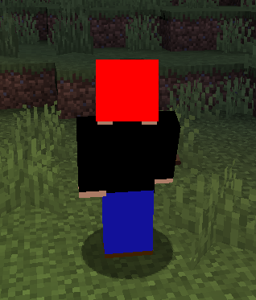 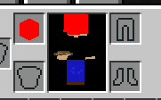 

  [Back to Top](#contents)

  ---

  ### entity_cutout 
  <h6>
    View on mcmeta:
    <a title="Open rendertype_entity_cutout.json on mcmeta" href="https://github.com/misode/mcmeta/blob/assets/assets/minecraft/shaders/core/rendertype_entity_cutout.json">json</a> • 
    <a title="Open rendertype_entity_cutout.vsh on mcmeta" href="https://github.com/misode/mcmeta/blob/assets/assets/minecraft/shaders/core/rendertype_entity_cutout.vsh">vsh</a> • 
    <a title="Open rendertype_entity_cutout.fsh on mcmeta" href="https://github.com/misode/mcmeta/blob/assets/assets/minecraft/shaders/core/rendertype_entity_cutout.fsh">fsh</a>
  </h6>

  Block items in the inventory or hand/head of an entity, chests, ender chests, chest in minecarts, fishing bobber, and as entities. Does not include Shulker boxes (see [entity_cutout_no_cull](#entity_cutout_no_cull)). Also used for the fire overlay on burning entities.

  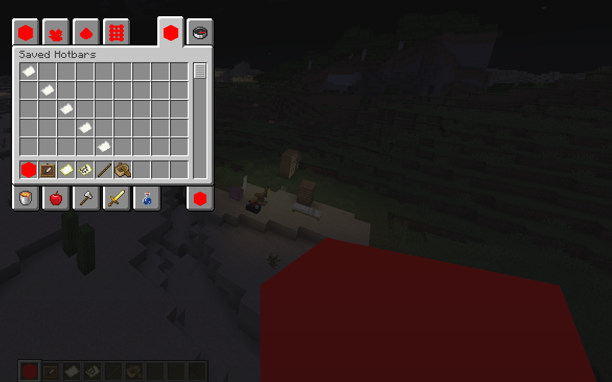 

  [Back to Top](#contents)

  ---

  ### entity_decal 
  <h6>
    View on mcmeta:
    <a title="Open rendertype_entity_decal.json on mcmeta" href="https://github.com/misode/mcmeta/blob/assets/assets/minecraft/shaders/core/rendertype_entity_decal.json">json</a> • 
    <a title="Open rendertype_entity_decal.vsh on mcmeta" href="https://github.com/misode/mcmeta/blob/assets/assets/minecraft/shaders/core/rendertype_entity_decal.vsh">vsh</a> • 
    <a title="Open rendertype_entity_decal.fsh on mcmeta" href="https://github.com/misode/mcmeta/blob/assets/assets/minecraft/shaders/core/rendertype_entity_decal.fsh">fsh</a>
  </h6>

  Colors the Ender Dragon while it’s dying.

  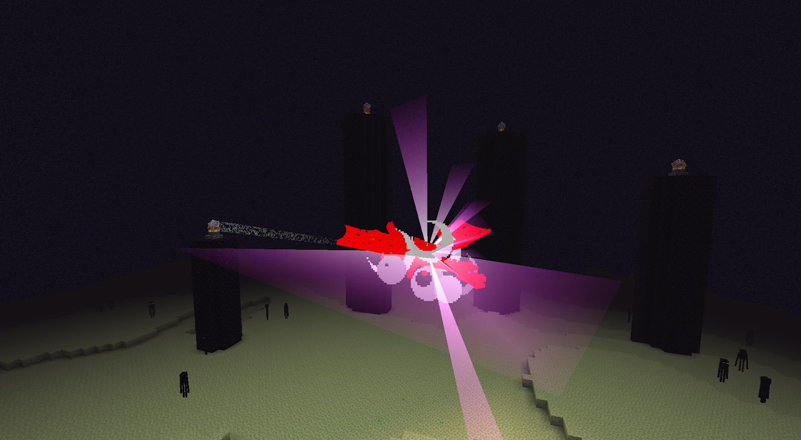 

  [Back to Top](#contents)

  ---

  ### item_entity_translucent_cull 
  <h6>
    View on mcmeta:
    <a title="Open rendertype_item_entity_translucent_cull.json on mcmeta" href="https://github.com/misode/mcmeta/blob/assets/assets/minecraft/shaders/core/rendertype_item_entity_translucent_cull.json">json</a> • 
    <a title="Open rendertype_item_entity_translucent_cull.vsh on mcmeta" href="https://github.com/misode/mcmeta/blob/assets/assets/minecraft/shaders/core/rendertype_item_entity_translucent_cull.vsh">vsh</a> • 
    <a title="Open rendertype_item_entity_translucent_cull.fsh on mcmeta" href="https://github.com/misode/mcmeta/blob/assets/assets/minecraft/shaders/core/rendertype_item_entity_translucent_cull.fsh">fsh</a>
  </h6>

  Handles dropped translucent items in Fabulous graphics. Also affects invisible entities while using spectator mode or the gamerule `seeFriendlyInvisibles`, as well as experience orbs in all graphics settings.

  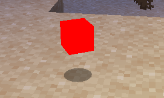 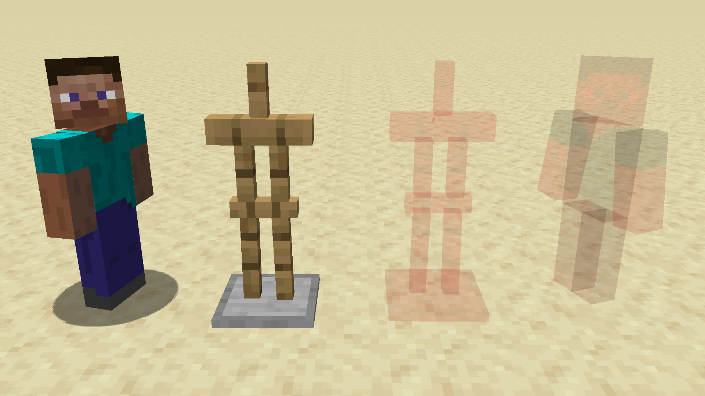 

  [Back to Top](#contents)

  ---

  ### entity_translucent_emissive 
  <h6>
    View on mcmeta:
    <a title="Open rendertype_entity_translucent_emissive.json on mcmeta" href="https://github.com/misode/mcmeta/blob/assets/assets/minecraft/shaders/core/rendertype_entity_translucent_emissive.json">json</a> • 
    <a title="Open rendertype_entity_translucent_emissive.vsh on mcmeta" href="https://github.com/misode/mcmeta/blob/assets/assets/minecraft/shaders/core/rendertype_entity_translucent_emissive.vsh">vsh</a> • 
    <a title="Open rendertype_entity_translucent_emissive.fsh on mcmeta" href="https://github.com/misode/mcmeta/blob/assets/assets/minecraft/shaders/core/rendertype_entity_translucent_emissive.fsh">fsh</a>
  </h6>

  Glowing parts of Warden texture.

  

  [Back to Top](#contents)

  ---

  ### entity_smooth_cutout 
  <h6>
    View on mcmeta:
    <a title="Open rendertype_entity_smooth_cutout.json on mcmeta" href="https://github.com/misode/mcmeta/blob/assets/assets/minecraft/shaders/core/rendertype_entity_smooth_cutout.json">json</a> • 
    <a title="Open rendertype_entity_smooth_cutout.vsh on mcmeta" href="https://github.com/misode/mcmeta/blob/assets/assets/minecraft/shaders/core/rendertype_entity_smooth_cutout.vsh">vsh</a> • 
    <a title="Open rendertype_entity_smooth_cutout.fsh on mcmeta" href="https://github.com/misode/mcmeta/blob/assets/assets/minecraft/shaders/core/rendertype_entity_smooth_cutout.fsh">fsh</a>
  </h6>

  End crystal beams.

  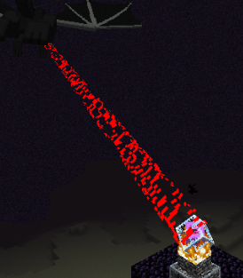 

  [Back to Top](#contents)

  ---

  ### entity_no_outline 
  <h6>
    View on mcmeta:
    <a title="Open rendertype_entity_no_outline.json on mcmeta" href="https://github.com/misode/mcmeta/blob/assets/assets/minecraft/shaders/core/rendertype_entity_no_outline.json">json</a> • 
    <a title="Open rendertype_entity_no_outline.vsh on mcmeta" href="https://github.com/misode/mcmeta/blob/assets/assets/minecraft/shaders/core/rendertype_entity_no_outline.vsh">vsh</a> • 
    <a title="Open rendertype_entity_no_outline.fsh on mcmeta" href="https://github.com/misode/mcmeta/blob/assets/assets/minecraft/shaders/core/rendertype_entity_no_outline.fsh">fsh</a>
  </h6>

  The color and pattern of banners.

  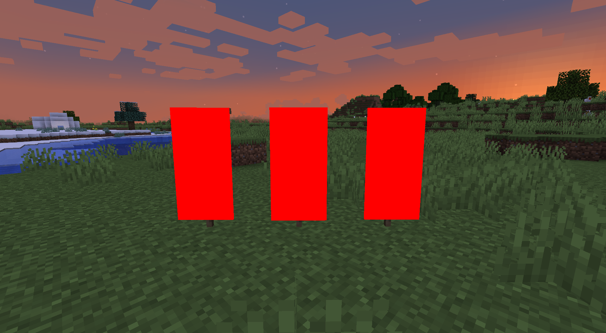 

  [Back to Top](#contents)

  ---

  ### entity_alpha 
  <h6>
    View on mcmeta:
    <a title="Open rendertype_entity_alpha.json on mcmeta" href="https://github.com/misode/mcmeta/blob/assets/assets/minecraft/shaders/core/rendertype_entity_alpha.json">json</a> • 
    <a title="Open rendertype_entity_alpha.vsh on mcmeta" href="https://github.com/misode/mcmeta/blob/assets/assets/minecraft/shaders/core/rendertype_entity_alpha.vsh">vsh</a> • 
    <a title="Open rendertype_entity_alpha.fsh on mcmeta" href="https://github.com/misode/mcmeta/blob/assets/assets/minecraft/shaders/core/rendertype_entity_alpha.fsh">fsh</a>
  </h6>

  Used in the death animation of the dragon. Seemingly only affects the dragon’s wings, possibly messed with in code?

   

  [Back to Top](#contents)

  ---

  ### water_mask 
  <h6>
    View on mcmeta:
    <a title="Open rendertype_water_mask.json on mcmeta" href="https://github.com/misode/mcmeta/blob/assets/assets/minecraft/shaders/core/rendertype_water_mask.json">json</a> • 
    <a title="Open rendertype_water_mask.vsh on mcmeta" href="https://github.com/misode/mcmeta/blob/assets/assets/minecraft/shaders/core/rendertype_water_mask.vsh">vsh</a> • 
    <a title="Open rendertype_water_mask.fsh on mcmeta" href="https://github.com/misode/mcmeta/blob/assets/assets/minecraft/shaders/core/rendertype_water_mask.fsh">fsh</a>
  </h6>

  Hides the water in a boat. Changing the color does not seem to have an effect, but changing the position does. Pictured left is moving the mask down by 64, pictured right is moving it to the right by 2.

  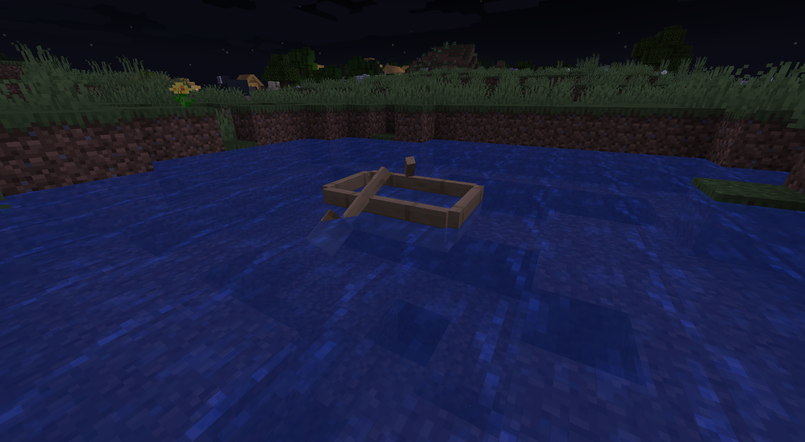 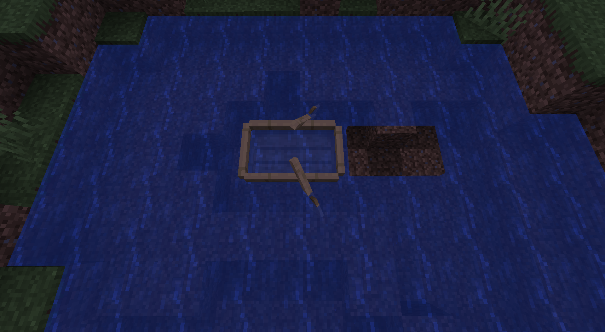 

  [Back to Top](#contents)

  ---

  ### outline 
  <h6>
    View on mcmeta:
    <a title="Open rendertype_outline.json on mcmeta" href="https://github.com/misode/mcmeta/blob/assets/assets/minecraft/shaders/core/rendertype_outline.json">json</a> • 
    <a title="Open rendertype_outline.vsh on mcmeta" href="https://github.com/misode/mcmeta/blob/assets/assets/minecraft/shaders/core/rendertype_outline.vsh">vsh</a> • 
    <a title="Open rendertype_outline.fsh on mcmeta" href="https://github.com/misode/mcmeta/blob/assets/assets/minecraft/shaders/core/rendertype_outline.fsh">fsh</a>
  </h6>

  Glowing effect on entities. This buffer draws color on the entire entity, which is later turned into an outline by the entity_outline post shader.

  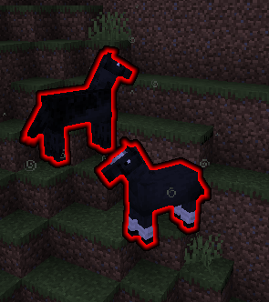 

  [Back to Top](#contents)

  ---

  ### lightning 
  <h6>
    View on mcmeta:
    <a title="Open rendertype_lightning.json on mcmeta" href="https://github.com/misode/mcmeta/blob/assets/assets/minecraft/shaders/core/rendertype_lightning.json">json</a> • 
    <a title="Open rendertype_lightning.vsh on mcmeta" href="https://github.com/misode/mcmeta/blob/assets/assets/minecraft/shaders/core/rendertype_lightning.vsh">vsh</a> • 
    <a title="Open rendertype_lightning.fsh on mcmeta" href="https://github.com/misode/mcmeta/blob/assets/assets/minecraft/shaders/core/rendertype_lightning.fsh">fsh</a>
  </h6>

  Lightning bolts.
  Ender dragon death animation beams.

  [Back to Top](#contents)

  ---

  ## UI
  These are shaders which affect some part of the UI. Some UI elements are rendered by [Non-Rendertype](#non-rendertype) shaders.

  ---

  ### gui 
  <h6>
    View on mcmeta:
    <a title="Open rendertype_gui.json on mcmeta" href="https://github.com/misode/mcmeta/blob/assets/assets/minecraft/shaders/core/rendertype_gui.json">json</a> • 
    <a title="Open rendertype_gui.vsh on mcmeta" href="https://github.com/misode/mcmeta/blob/assets/assets/minecraft/shaders/core/rendertype_gui.vsh">vsh</a> • 
    <a title="Open rendertype_gui.fsh on mcmeta" href="https://github.com/misode/mcmeta/blob/assets/assets/minecraft/shaders/core/rendertype_gui.fsh">fsh</a>
  </h6>

  * The black transparent background on UI elements such as the chat field, the pause menu, the scoreboard sidebar, and subtitles
  * The Mojang resource pack loading bar
  * Highlighting worlds, servers, and players in social interactions menu
  * The background of tooltips
  * Scroll bar and scroll bar background
  * World selection, recipe book, and social interactions search bar background
  * World loading animation
  * Crafting red missing item background (when using recipe book)

   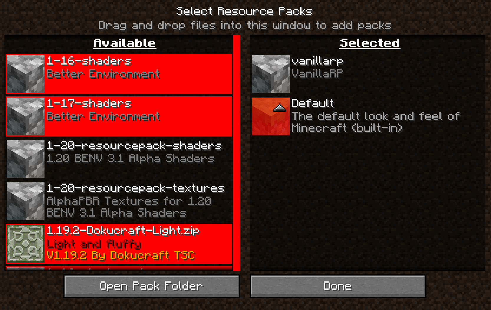 

  [Back to Top](#contents)

  ---

  ### gui_ghost_recipe_overlay 
  <h6>
    View on mcmeta:
    <a title="Open rendertype_gui_ghost_recipe_overlay.json on mcmeta" href="https://github.com/misode/mcmeta/blob/assets/assets/minecraft/shaders/core/rendertype_gui_ghost_recipe_overlay.json">json</a> • 
    <a title="Open rendertype_gui_ghost_recipe_overlay.vsh on mcmeta" href="https://github.com/misode/mcmeta/blob/assets/assets/minecraft/shaders/core/rendertype_gui_ghost_recipe_overlay.vsh">vsh</a> • 
    <a title="Open rendertype_gui_ghost_recipe_overlay.fsh on mcmeta" href="https://github.com/misode/mcmeta/blob/assets/assets/minecraft/shaders/core/rendertype_gui_ghost_recipe_overlay.fsh">fsh</a>
  </h6>

  * Crafting translucent missing item overlay (when using recipe book)

  <figure>
    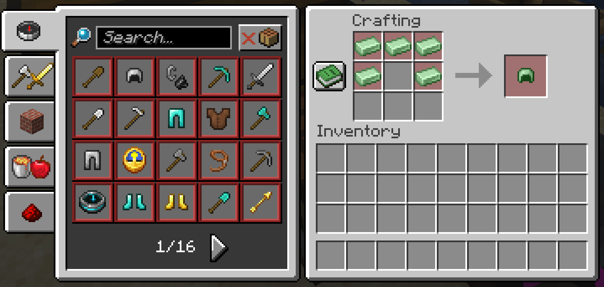 
    <figcaption>*highlighted in green for better contrast*</figcaption>
  </figure>

  [Back to Top](#contents)

  ---

  ### gui_overlay 
  <h6>
    View on mcmeta:
    <a title="Open rendertype_gui_overlay.json on mcmeta" href="https://github.com/misode/mcmeta/blob/assets/assets/minecraft/shaders/core/rendertype_gui_overlay.json">json</a> • 
    <a title="Open rendertype_gui_overlay.vsh on mcmeta" href="https://github.com/misode/mcmeta/blob/assets/assets/minecraft/shaders/core/rendertype_gui_overlay.vsh">vsh</a> • 
    <a title="Open rendertype_gui_overlay.fsh on mcmeta" href="https://github.com/misode/mcmeta/blob/assets/assets/minecraft/shaders/core/rendertype_gui_overlay.fsh">fsh</a>
  </h6>

  * The Mojang resource pack loading background color
  * The black bars on the sides when scoped in with a spyglass
  * Highlighting item slots
  * World and server selection menu drop-shadow

  [Back to Top](#contents)

  ---

  ### gui_text_highlight 
  <h6>
    View on mcmeta:
    <a title="Open rendertype_gui_text_highlight.json on mcmeta" href="https://github.com/misode/mcmeta/blob/assets/assets/minecraft/shaders/core/rendertype_gui_text_highlight.json">json</a> • 
    <a title="Open rendertype_gui_text_highlight.vsh on mcmeta" href="https://github.com/misode/mcmeta/blob/assets/assets/minecraft/shaders/core/rendertype_gui_text_highlight.vsh">vsh</a> • 
    <a title="Open rendertype_gui_text_highlight.fsh on mcmeta" href="https://github.com/misode/mcmeta/blob/assets/assets/minecraft/shaders/core/rendertype_gui_text_highlight.fsh">fsh</a>
  </h6>

  * All highlighted/selected text

  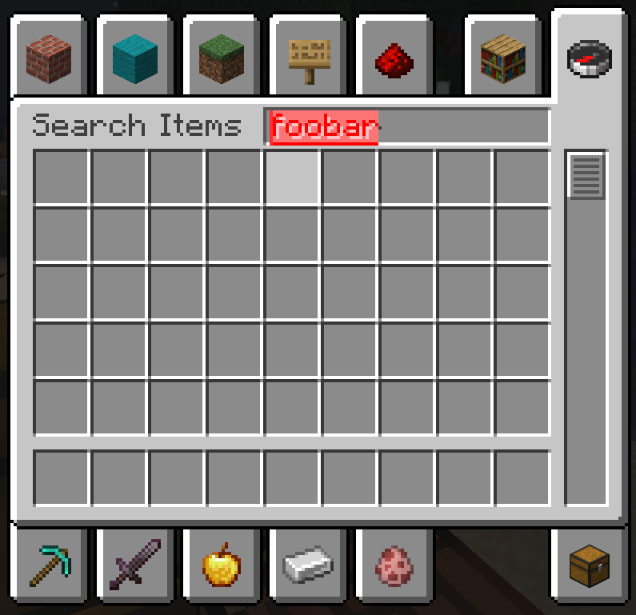 

  [Back to Top](#contents)

  ---

  ### text 
  <h6>
    View on mcmeta:
    <a title="Open rendertype_text.json on mcmeta" href="https://github.com/misode/mcmeta/blob/assets/assets/minecraft/shaders/core/rendertype_text.json">json</a> • 
    <a title="Open rendertype_text.vsh on mcmeta" href="https://github.com/misode/mcmeta/blob/assets/assets/minecraft/shaders/core/rendertype_text.vsh">vsh</a> • 
    <a title="Open rendertype_text.fsh on mcmeta" href="https://github.com/misode/mcmeta/blob/assets/assets/minecraft/shaders/core/rendertype_text.fsh">fsh</a>
  </h6>

  All parts of text, including the shadow. This encompasses all text rendered including: F3 Menu, Menu button text, Entity names, Text display entities, Item names, descriptions & amounts in the inventory and the Chat etc. It also does the explored parts of maps

  ---

  #### Isolating Elements
  Isolating certain texts. Different types of text can be isolated using their Position.z. Texts without a shadow are located at x, texts with a shadow are located at x + 0.03 with their shadow being at x. (e.g. at 0.0 and 0.03). *This seems to no longer be true in 1.19.4*

  A basic list of where which text is located: (Not Complete! *Last checked in 1.18, unless noted otherwise*)
  * -200: Advancement menu text
  * 0: /title text, bossbar name, world/server selection name/description text, resourcepack selection "Available" and "Selected" text.
  * 0.03: Menu (pause/options) text and inventory Potion effect text
  * 0.06 [1.19.4]: Subtitle Text (shadow at 0.0)
  * 0.12 [1.19.4]: Title Text (shadow at 0.0)
  * 100: Chat display, Recipe book search text
  * 200: Item count in hotbar
  * 300: Item count in inventory
  * 400: Item count while dragging item, tooltip texts, compact potion info
  * 0 to 104: Maps (not actually text)
  * 0.1 [1.21.1]: Chat Text Shadow
  * 0.0 [1.21.1]: Chat Input Text Shadow, Container Titles
  * 1800.0 [1.21.1]: F3 Text Background

  Since maps share the z value with the chat display and a part of the hotbar item count, you can test for Sampler0 having a size of 128 pixels in both directions to test for the face being a map.

  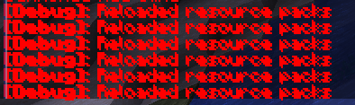

  [Back to Top](#contents)

  ---

  ### text_see_through 
  <h6>
    View on mcmeta:
    <a title="Open rendertype_text_see_through.json on mcmeta" href="https://github.com/misode/mcmeta/blob/assets/assets/minecraft/shaders/core/rendertype_text_see_through.json">json</a> • 
    <a title="Open rendertype_text_see_through.vsh on mcmeta" href="https://github.com/misode/mcmeta/blob/assets/assets/minecraft/shaders/core/rendertype_text_see_through.vsh">vsh</a> • 
    <a title="Open rendertype_text_see_through.fsh on mcmeta" href="https://github.com/misode/mcmeta/blob/assets/assets/minecraft/shaders/core/rendertype_text_see_through.fsh">fsh</a>
  </h6>

  * The background nameplate of an entity’s custom name
  * Nametag text when seen through walls
  * Text display entity text when `see_through:true` nbt is set

  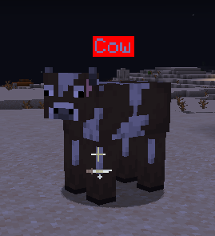

  [Back to Top](#contents)

  ---

  ### text_background 
  <h6>
    View on mcmeta:
    <a title="Open rendertype_text_background.json on mcmeta" href="https://github.com/misode/mcmeta/blob/assets/assets/minecraft/shaders/core/rendertype_text_background.json">json</a> • 
    <a title="Open rendertype_text_background.vsh on mcmeta" href="https://github.com/misode/mcmeta/blob/assets/assets/minecraft/shaders/core/rendertype_text_background.vsh">vsh</a> • 
    <a title="Open rendertype_text_background.fsh on mcmeta" href="https://github.com/misode/mcmeta/blob/assets/assets/minecraft/shaders/core/rendertype_text_background.fsh">fsh</a>
  </h6>

  * Text display entity background box

  [Back to Top](#contents)

  ---

  ### text_background_see_through 
  <h6>
    View on mcmeta:
    <a title="Open rendertype_text_background_see_through.json on mcmeta" href="https://github.com/misode/mcmeta/blob/assets/assets/minecraft/shaders/core/rendertype_text_background_see_through.json">json</a> • 
    <a title="Open rendertype_text_background_see_through.vsh on mcmeta" href="https://github.com/misode/mcmeta/blob/assets/assets/minecraft/shaders/core/rendertype_text_background_see_through.vsh">vsh</a> • 
    <a title="Open rendertype_text_background_see_through.fsh on mcmeta" href="https://github.com/misode/mcmeta/blob/assets/assets/minecraft/shaders/core/rendertype_text_background_see_through.fsh">fsh</a>
  </h6>

  * Text display entity background box when `see_through:true` nbt is set

  [Back to Top](#contents)

  ---

  ### text_intensity 
  <h6>
    View on mcmeta:
    <a title="Open rendertype_text_intensity.json on mcmeta" href="https://github.com/misode/mcmeta/blob/assets/assets/minecraft/shaders/core/rendertype_text_intensity.json">json</a> • 
    <a title="Open rendertype_text_intensity.vsh on mcmeta" href="https://github.com/misode/mcmeta/blob/assets/assets/minecraft/shaders/core/rendertype_text_intensity.vsh">vsh</a> • 
    <a title="Open rendertype_text_intensity.fsh on mcmeta" href="https://github.com/misode/mcmeta/blob/assets/assets/minecraft/shaders/core/rendertype_text_intensity.fsh">fsh</a>
  </h6>

  * Behaves like rendertype_text but when TTF font is used in the resourcepack
  * See [text](#text)

  

  [Back to Top](#contents)

  ---

  ### text_intensity_see_through 
  <h6>
    View on mcmeta:
    <a title="Open rendertype_text_intensity_see_through.json on mcmeta" href="https://github.com/misode/mcmeta/blob/assets/assets/minecraft/shaders/core/rendertype_text_intensity_see_through.json">json</a> • 
    <a title="Open rendertype_text_intensity_see_through.vsh on mcmeta" href="https://github.com/misode/mcmeta/blob/assets/assets/minecraft/shaders/core/rendertype_text_intensity_see_through.vsh">vsh</a> • 
    <a title="Open rendertype_text_intensity_see_through.fsh on mcmeta" href="https://github.com/misode/mcmeta/blob/assets/assets/minecraft/shaders/core/rendertype_text_intensity_see_through.fsh">fsh</a>
  </h6>

  * Behaves like rendertype_text_see_through but when TTF font is used in the resourcepack
  * See [text_see_through](#text_see_through)

  [Back to Top](#contents)
    
  ---

  ## Other
  These are shaders that render things that aren't clearly either a block, an entity or a ui element.

  ### lines 
  <h6>
    View on mcmeta:
    <a title="Open rendertype_lines.json on mcmeta" href="https://github.com/misode/mcmeta/blob/assets/assets/minecraft/shaders/core/rendertype_lines.json">json</a> • 
    <a title="Open rendertype_lines.vsh on mcmeta" href="https://github.com/misode/mcmeta/blob/assets/assets/minecraft/shaders/core/rendertype_lines.vsh">vsh</a> • 
    <a title="Open rendertype_lines.fsh on mcmeta" href="https://github.com/misode/mcmeta/blob/assets/assets/minecraft/shaders/core/rendertype_lines.fsh">fsh</a>
  </h6>

  Handles a few different things:
  * The outline when hovering over a block,
  * The debug crosshair,
  * The f3+B hitbox displays,
  * Previews in the structure block.

  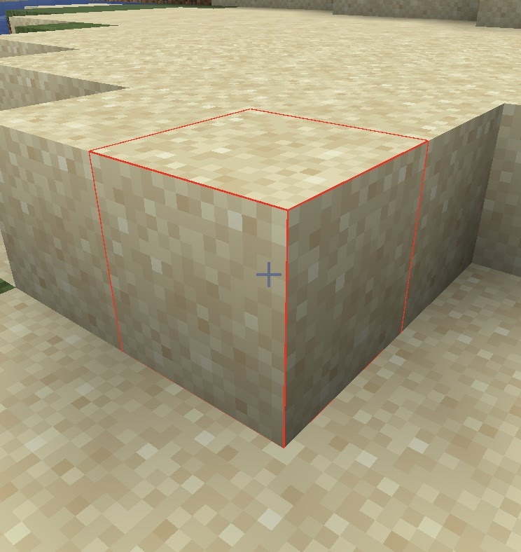 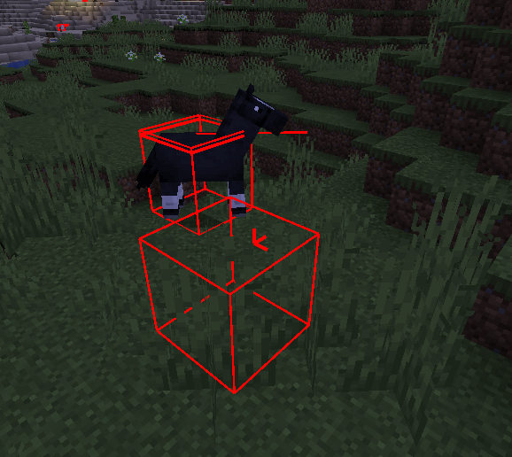

  [Back to Top](#contents)

  ---

  ### crumbling 
  <h6>
    View on mcmeta:
    <a title="Open rendertype_crumbling.json on mcmeta" href="https://github.com/misode/mcmeta/blob/assets/assets/minecraft/shaders/core/rendertype_crumbling.json">json</a> • 
    <a title="Open rendertype_crumbling.vsh on mcmeta" href="https://github.com/misode/mcmeta/blob/assets/assets/minecraft/shaders/core/rendertype_crumbling.vsh">vsh</a> • 
    <a title="Open rendertype_crumbling.fsh on mcmeta" href="https://github.com/misode/mcmeta/blob/assets/assets/minecraft/shaders/core/rendertype_crumbling.fsh">fsh</a>
  </h6>

  The block cracks when mining a block. Has some in-built transparency.  

  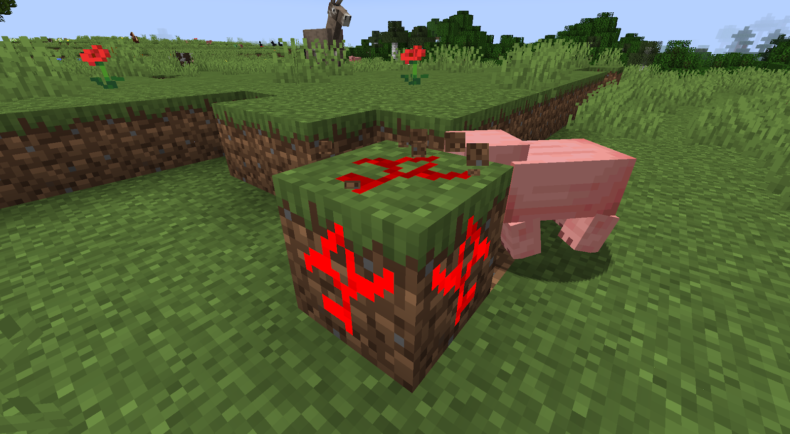

  [Back to Top](#contents)

  ---

  ### clouds 
  <h6>
    View on mcmeta:
    <a title="Open rendertype_clouds.json on mcmeta" href="https://github.com/misode/mcmeta/blob/assets/assets/minecraft/shaders/core/rendertype_clouds.json">json</a> • 
    <a title="Open rendertype_clouds.vsh on mcmeta" href="https://github.com/misode/mcmeta/blob/assets/assets/minecraft/shaders/core/rendertype_clouds.vsh">vsh</a> • 
    <a title="Open rendertype_clouds.fsh on mcmeta" href="https://github.com/misode/mcmeta/blob/assets/assets/minecraft/shaders/core/rendertype_clouds.fsh">fsh</a>
  </h6>

  Clouds.  
  Prior to 24w05a, the shader was not a rendertype and was named `position_tex_color_normal`.  

  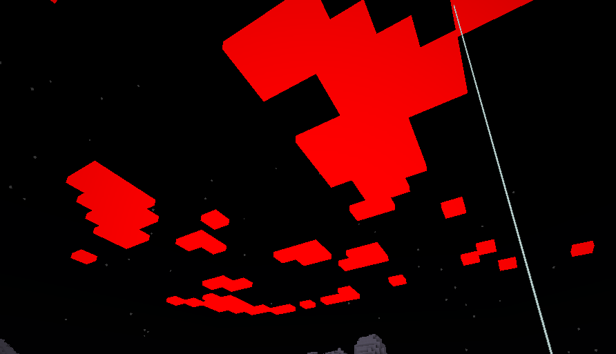

  [Back to Top](#contents)

  ---

  ### beacon_beam 
  <h6>
    View on mcmeta:
    <a title="Open rendertype_beacon_beam.json on mcmeta" href="https://github.com/misode/mcmeta/blob/assets/assets/minecraft/shaders/core/rendertype_beacon_beam.json">json</a> • 
    <a title="Open rendertype_beacon_beam.vsh on mcmeta" href="https://github.com/misode/mcmeta/blob/assets/assets/minecraft/shaders/core/rendertype_beacon_beam.vsh">vsh</a> • 
    <a title="Open rendertype_beacon_beam.fsh on mcmeta" href="https://github.com/misode/mcmeta/blob/assets/assets/minecraft/shaders/core/rendertype_beacon_beam.fsh">fsh</a>
  </h6>

  The beam of a beacon. Seems to get rendered behind clouds.  

  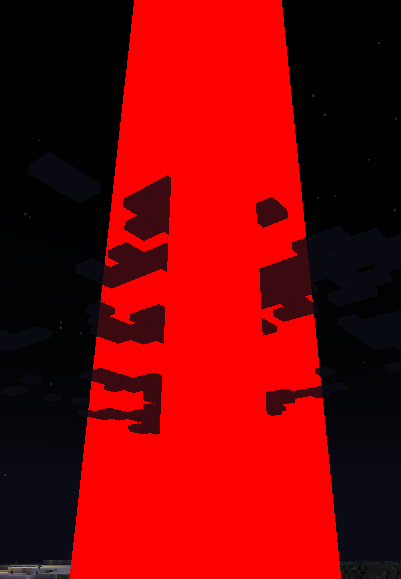

  [Back to Top](#contents)

  # Unknown

  These are shaders that exist in the files that we do not currently know the purpose of. More testing is needed for these.

  ### position_color_lightmap 
  <h6>
    View on mcmeta:
    <a title="Open position_color_lightmap.json on mcmeta" href="https://github.com/misode/mcmeta/blob/assets/assets/minecraft/shaders/core/position_color_lightmap.json">json</a> • 
    <a title="Open position_color_lightmap.vsh on mcmeta" href="https://github.com/misode/mcmeta/blob/assets/assets/minecraft/shaders/core/position_color_lightmap.vsh">vsh</a> • 
    <a title="Open position_color_lightmap.fsh on mcmeta" href="https://github.com/misode/mcmeta/blob/assets/assets/minecraft/shaders/core/position_color_lightmap.fsh">fsh</a>
  </h6>

  Similar to `position_color`, but includes a second sampler for lightmap calculations. Not observed ingame.

  [Back to Top](#contents)

  ---

  ### position_color_tex_lightmap 
  <h6>
    View on mcmeta:
    <a title="Open position_color_tex_lightmap.json on mcmeta" href="https://github.com/misode/mcmeta/blob/assets/assets/minecraft/shaders/core/position_color_tex_lightmap.json">json</a> • 
    <a title="Open position_color_tex_lightmap.vsh on mcmeta" href="https://github.com/misode/mcmeta/blob/assets/assets/minecraft/shaders/core/position_color_tex_lightmap.vsh">vsh</a> • 
    <a title="Open position_color_tex_lightmap.fsh on mcmeta" href="https://github.com/misode/mcmeta/blob/assets/assets/minecraft/shaders/core/position_color_tex_lightmap.fsh">fsh</a>
  </h6>

  Similar to `position_color_tex`, but includes a second sampler for lightmap calculations. Not observed ingame.

  [Back to Top](#contents)

  # Removed

  ### block

  > ***Removed in 23w18a*** 
  > View last available version on mcmeta: <a title="View block.json on mcmeta" href="https://github.com/misode/mcmeta/blob/42558a1a7b43ece54d6423b299ba4c905237e95b/assets/minecraft/shaders/core/block.json">json</a> • <a title="View block.vsh on mcmeta" href="https://github.com/misode/mcmeta/blob/42558a1a7b43ece54d6423b299ba4c905237e95b/assets/minecraft/shaders/core/block.vsh">vsh</a> • <a title="View block.fsh on mcmeta" href="https://github.com/misode/mcmeta/blob/42558a1a7b43ece54d6423b299ba4c905237e95b/assets/minecraft/shaders/core/block.fsh">fsh</a>

  Has 2 ins (`UV0` and `UV2`) and 2 outs (`texCoord0` and `texCoord2`), no math other than what’s included in most other shaders. Not observed ingame, may only be used as a base.

  [Back to Top](#contents)

  ---

  ### new_entity

  > ***Removed in 23w18a*** 
  > View last available version on mcmeta: <a title="View new_entity.json on mcmeta" href="https://github.com/misode/mcmeta/blob/42558a1a7b43ece54d6423b299ba4c905237e95b/assets/minecraft/shaders/core/new_entity.json">json</a> • <a title="View new_entity.vsh on mcmeta" href="https://github.com/misode/mcmeta/blob/42558a1a7b43ece54d6423b299ba4c905237e95b/assets/minecraft/shaders/core/new_entity.vsh">vsh</a> • <a title="View new_entity.fsh on mcmeta" href="https://github.com/misode/mcmeta/blob/42558a1a7b43ece54d6423b299ba4c905237e95b/assets/minecraft/shaders/core/new_entity.fsh">fsh</a>

  Has 3 ins (`UV0`, `UV1`, and `UV2`) and 3 outs (`texCoord0`, `texCoord1`, and `texCoord2`), no math other than what’s included in most other shaders. Not observed ingame, may only be used as a base.

  [Back to Top](#contents)

  ---

  ### rendertype_translucent_no_crumbling

  > ***Removed in 23w42a*** 
  > View last available version on mcmeta: <a title="View rendertype_translucent_no_crumbling.json on mcmeta" href="https://github.com/misode/mcmeta/blob/92a894bdc858d414a71ad0407422a1932b408a55/assets/minecraft/shaders/core/rendertype_translucent_no_crumbling.json">json</a> • <a title="View rendertype_translucent_no_crumbling.vsh on mcmeta" href="https://github.com/misode/mcmeta/blob/92a894bdc858d414a71ad0407422a1932b408a55/assets/minecraft/shaders/core/rendertype_translucent_no_crumbling.vsh">vsh</a> • <a title="View rendertype_translucent_no_crumbling.fsh on mcmeta" href="https://github.com/misode/mcmeta/blob/92a894bdc858d414a71ad0407422a1932b408a55/assets/minecraft/shaders/core/rendertype_translucent_no_crumbling.fsh">fsh</a>

  Unknown.

  [Back to Top](#contents)

  ---

  ### position_color_tex 

  > ***Removed in 24w21a*** 
  > Merged with [position_tex_color](#position_tex_color) 
  > View last available version on mcmeta: <a title="Open position_color_tex.json on mcmeta" href="https://github.com/misode/mcmeta/blob/8973096b19ea289821ca208d374c1b87dd078bff/assets/minecraft/shaders/core/position_color_tex.json">json</a> • 
    <a title="Open position_color_tex.vsh on mcmeta" href="https://github.com/misode/mcmeta/blob/8973096b19ea289821ca208d374c1b87dd078bff/assets/minecraft/shaders/core/position_color_tex.vsh">vsh</a> • 
    <a title="Open position_color_tex.fsh on mcmeta" href="https://github.com/misode/mcmeta/blob/8973096b19ea289821ca208d374c1b87dd078bff/assets/minecraft/shaders/core/position_color_tex.fsh">fsh</a>
  </h6>

  Was previously used for:
  * Fire overlay when the player is burning
  * Wall overlay when player is suffocating

  
  

  [Back to Top](#contents)

  ---

  ### rendertype_glint_direct 

  > ***Removed in 24w21a*** 
  > Merged with [rendertype_glint](#glint) 
  > View last available version on mcmeta: <a title="Open rendertype_glint_direct.json on mcmeta" href="https://github.com/misode/mcmeta/blob/8973096b19ea289821ca208d374c1b87dd078bff/assets/minecraft/shaders/core/rendertype_glint_direct.json">json</a> • <a title="Open rendertype_glint_direct.vsh on mcmeta" href="https://github.com/misode/mcmeta/blob/8973096b19ea289821ca208d374c1b87dd078bff/assets/minecraft/shaders/core/rendertype_glint_direct.vsh">vsh</a> • <a title="Open rendertype_glint_direct.fsh on mcmeta" href="https://github.com/misode/mcmeta/blob/8973096b19ea289821ca208d374c1b87dd078bff/assets/minecraft/shaders/core/rendertype_glint_direct.fsh">fsh</a>

  Was previously used for the enchant glint in most situations. Enchanted worn armor was rendered by `armor_entity_glint` and glass type blocks were rendered by `glint` when in world instead.

  [Back to Top](#contents)

---

  ### rendertype_armor_glint

  > ***Removed in 24w21a*** 
  > View last available version on mcmeta: <a title="Open rendertype_armor_glint.json on mcmeta" href="https://github.com/misode/mcmeta/blob/8973096b19ea289821ca208d374c1b87dd078bff/assets/minecraft/shaders/core/rendertype_armor_glint.json">json</a> • <a title="Open rendertype_armor_glint.vsh on mcmeta" href="https://github.com/misode/mcmeta/blob/8973096b19ea289821ca208d374c1b87dd078bff/assets/minecraft/shaders/core/rendertype_armor_glint.vsh">vsh</a> • <a title="Open rendertype_armor_glint.fsh on mcmeta" href="https://github.com/misode/mcmeta/blob/8973096b19ea289821ca208d374c1b87dd078bff/assets/minecraft/shaders/core/rendertype_armor_glint.fsh">fsh</a>

  Was unused.

  [Back to Top](#contents)

  ---
