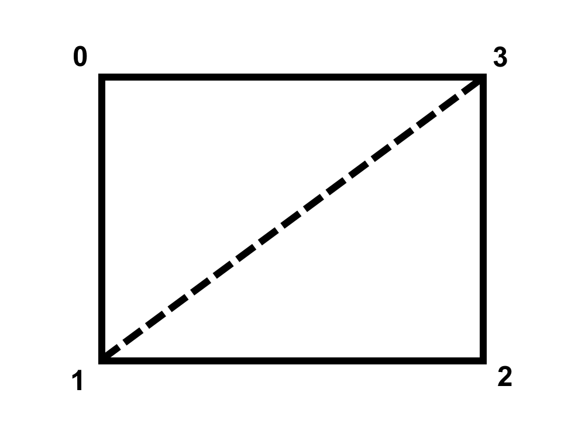

# Utilities & Information

## [Onnowhere's Shader Utilities](https://github.com/onnowhere/core_shaders/blob/master/.shader_utils/vsh_util.glsl)
This includes functions to get a WorldMat, OrthoMat, get the current FOV, detect if the position is in the Nether and detect if something is being rendered as a gui element and more.

## [Suso's Shader Reload Mod](https://www.curseforge.com/minecraft/mc-mods/shader-reload)
A fabric mod that allows reloading shaders without having to reload the resource pack. Also makes it so errors are printed in chat and don't remove the current resource packs.

## Ancientkingg's gl_VertexID reference
gl_VertexID order in core shaders, where 0,0 is center of rectangle and 0 is -1,-1. You can obtain this value by computing `gl_VertexID % 4`.

## [Godlander's .obj model renderer](https://github.com/Godlander/objmc)
A python script to convert .OBJ files into Minecraft, rendering them in game with a core shader.

# Examples

## [Ancientkingg's Fancy Pants](https://github.com/Ancientkingg/fancyPants)
Fancy Pants is a shader for 1.17 vanilla minecraft that allows datapack developers to add custom armor to minecraft by using leather armor

## [Shock Micro's VanillaDynamicEmissives](https://github.com/ShockMicro/VanillaDynamicEmissives/)
Allows for dynamic emissive textures in vanilla Minecraft.

## [Ts's collection of examples](https://github.com/McTsts/mc-core-shaders)
A collection of relatively small free to use shaders.

## [bradleyq's optifine-like vanilla shaders](https://github.com/bradleyq/mc_vanilla_shaders)
A resource pack that tries to add as much as possible from OptiFine shaders to the vanilla transparency shader available in "Fabulous" graphics setting.

## [Godlander's v++](https://github.com/Godlander/vpp)
A vanilla minecraft complimentary resourcepack focused on improving visual quality and the survival experience.
